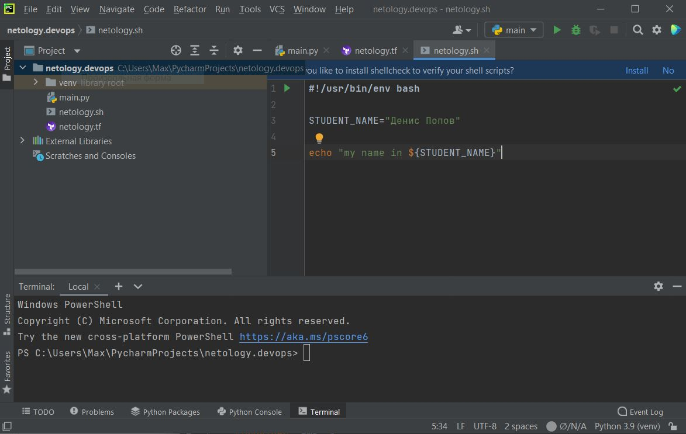
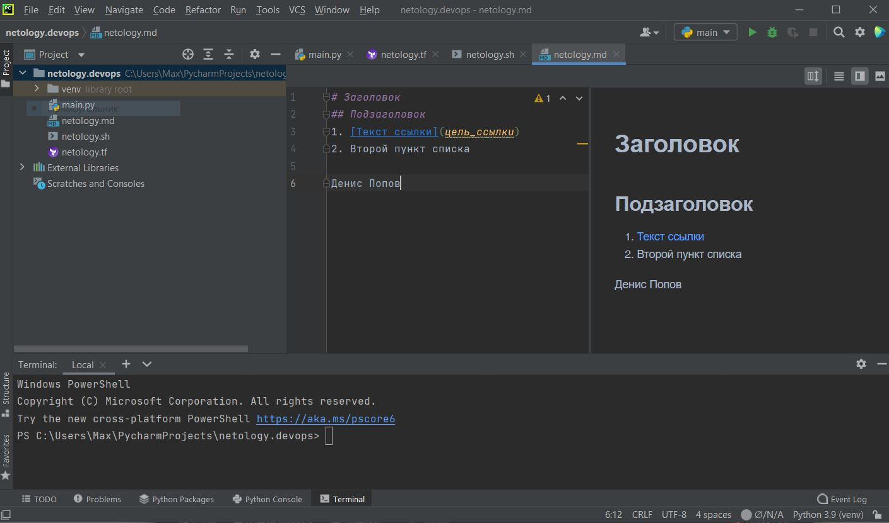
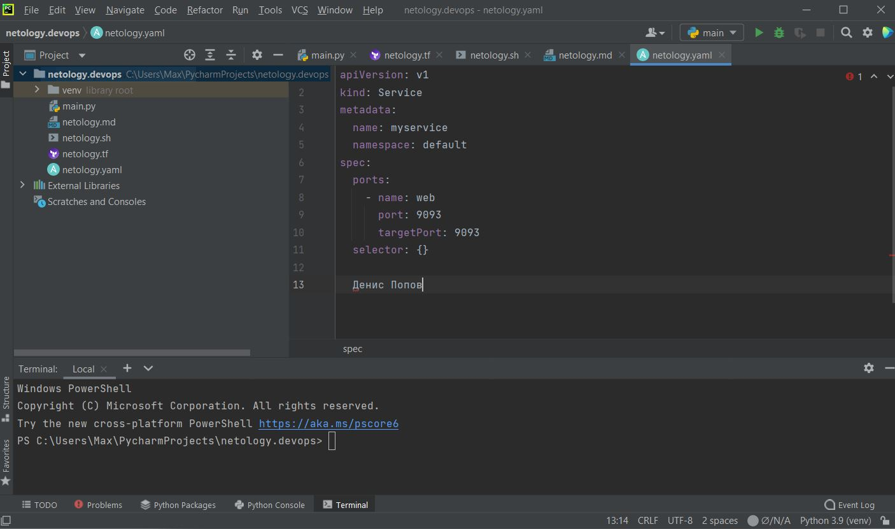
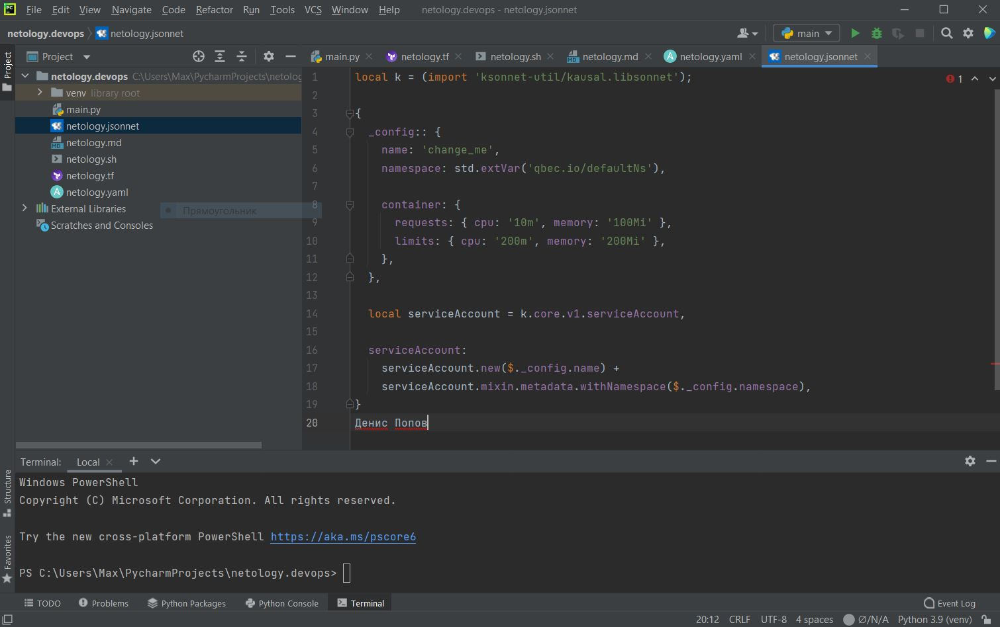

# Домашнее задание к занятию «1.1. Введение в DevOps»

## Задание №1 - Подготовка рабочей среды

Убеждаемся, что работает подсветка синтаксиса:
  - Terraform: 
  - Bash: 
  - Markdown: 
  - Yaml: 
  - Jsonnet: 

## Задание №2 - Жизненный цикл задачи (разработка функционала)
1. Сперва менеджер контактирует с клиентом и составляет ТЗ для функционала.
2. Далее менеджер взаимодействует с проджект-менеджером, они
уточняет необходимый состав команды и передают ТЗ тимлиду, согласует с ним сроки, порядок и содержание работ.
3. Далее менеджеры уточняют состав подлежащих лицензированию компонент, заключают лицензионные соглашения, подписывают договор с клиентом.
4. Далее тимлид совместно с девопсом определяют конфигурацию для разработки, тестирования и деплоя.
5. Девопс подготавливает площадки для разработки, тестирования, деплоя и поддерживает их при помощи мониторинга фсех необходимых компонент и метрик, отслеживая их безопасность.
7. Команда тестировщиков разрабатывает и проводит юнит, функциональные и приемочные тесты.
8. Далее тестировщики совместно с девопсом налаживает мониторинг функционала продукта для оперативного устранения выявившихся неполадок.
9. Менеджеры и команда разработки получают обратную связь от клиента и получают ТЗ на разработку следующего функционала
