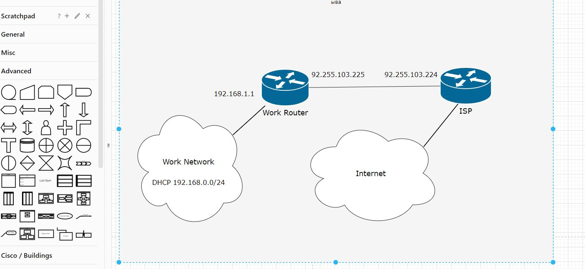

# Домашнее задание к занятию "3.8. Компьютерные сети, лекция 3"

1. Подключитесь к публичному маршрутизатору в интернет. Найдите маршрут к вашему публичному IP
```
telnet route-views.routeviews.org
Username: rviews
show ip route x.x.x.x/32
show bgp x.x.x.x/32
```
* Команда `show ip route 185.108.4.123.` выдает следующие данные:</br>
```commandline
Rroute-views>show ip route 185.108.4.123
Routing entry for 185.108.4.0/24
  Known via "bgp 6447", distance 20, metric 0
  Tag 6939, type external
  Last update from 64.71.137.241 1w2d ago
  Routing Descriptor Blocks:
  * 64.71.137.241, from 64.71.137.241, 1w2d ago
      Route metric is 0, traffic share count is 1
      AS Hops 2
      Route tag 6939
      MPLS label: none
route-views>
```
* Команда `show bgp 185.108.4.123 ` выдает следующие данные: </br>
```commandline
route-views>show bgp 185.104.4.123
BGP routing table entry for 185.104.4.0/22, version 313143275
Paths: (23 available, best #11, table default)
  Not advertised to any peer
  Refresh Epoch 1
  101 174 12389 201776 25591
    209.124.176.223 from 209.124.176.223 (209.124.176.223)
      Origin IGP, localpref 100, valid, external
      Community: 101:20100 101:20110 101:22100 174:21101 174:22005
      Extended Community: RT:101:22100
      path 7FE17D9E1588 RPKI State valid
      rx pathid: 0, tx pathid: 0
  Refresh Epoch 1
  3333 1257 28917 48084 25591
    193.0.0.56 from 193.0.0.56 (193.0.0.56)
      Origin IGP, localpref 100, valid, external
      Community: 1257:50 1257:51 1257:2000 1257:3428 1257:4103 28917:2000 28917:2299 28917:5112 28917:5310 28917:5330 28917:5570 48084:1000
      path 7FE0D5C59090 RPKI State valid
      rx pathid: 0, tx pathid: 0
  Refresh Epoch 2
  8283 28917 48084 25591
    94.142.247.3 from 94.142.247.3 (94.142.247.3)
      Origin IGP, metric 0, localpref 100, valid, external
      Community: 0:6939 0:16276 8283:1 8283:101 8283:103 28917:2000 28917:2299 28917:5112 28917:5310 28917:5330 28917:5570 48084:1000
      unknown transitive attribute: flag 0xE0 type 0x20 length 0x24
        value 0000 205B 0000 0000 0000 0001 0000 205B
              0000 0005 0000 0001 0000 205B 0000 0005
              0000 0003
      path 7FE0B4AF6040 RPKI State valid
      rx pathid: 0, tx pathid: 0
  Refresh Epoch 1
  852 3356 12389 201776 25591
    154.11.12.212 from 154.11.12.212 (96.1.209.43)
      Origin IGP, metric 0, localpref 100, valid, external
      path 7FE12BEE4540 RPKI State valid
      rx pathid: 0, tx pathid: 0
  Refresh Epoch 1
  1351 6939 12389 201776 25591
    132.198.255.253 from 132.198.255.253 (132.198.255.253)
      Origin IGP, localpref 100, valid, external
      path 7FE170C5F448 RPKI State valid
      rx pathid: 0, tx pathid: 0
  Refresh Epoch 1
  57866 28917 48084 25591
    37.139.139.17 from 37.139.139.17 (37.139.139.17)
      Origin IGP, metric 0, localpref 100, valid, external
      Community: 0:6939 0:16276 28917:2000 28917:2299 28917:5112 28917:5310 28917:5330 28917:5570 48084:1000 57866:304 57866:501
 --More--
```
2. Создайте dummy0 интерфейс в Ubuntu. Добавьте несколько статических маршрутов. Проверьте таблицу маршрутизации.
* Добавляем, загружаем и проверяем модуль: </br>
```commandline
echo "dummy">>/etc/modules
echo "options dummy numdummies=2" >> /etc/modprobe.d/dummy.conf
modprobe dummy
lsmod| grep dummy
```
* Конфигурация `/etc/netplan/01-netcfg.yaml`:
```commandline
network:
  version: 2
  renderer: networkd
  ethernets:
    eth0:
      dhcp4: true
  bridges:
    dummy0:
      dhcp4: no
      dhcp6: no
      accept-ra: no
      interfaces: [ ]
      addresses:
        - 10.0.2.16/24
```
* Добавляем новый маршрут
```commandline
ip route add 8.8.8.8 via 10.0.2.2 dev eth0
```

* Проверяем таблицу маршрутизации: </br>
```commandline
root@vagrant:~# ip route show
default via 10.0.2.2 dev eth0
8.8.8.8 via 10.0.2.2 dev eth0
10.0.2.0 via 192.168.2.16 dev dummy0
10.0.2.0/24 dev eth0 proto kernel scope link src 10.0.2.15
10.0.2.2 dev eth0 proto dhcp scope link src 10.0.2.15 metric 100
192.168.2.0/24 dev dummy0 proto kernel scope link src 192.168.2.16
root@vagrant:~#

```

3. Проверьте открытые TCP порты в Ubuntu, какие протоколы и приложения используют эти порты? Приведите несколько примеров.
* Проверить открытые TCP порты и использующие их программы можно командой `ss -tpan` или: </br>
```commandline
root@vagrant:~# root@vagrant:~# ss -tpan
State         Recv-Q         Send-Q                 Local Address:Port                 Peer Address:Port         Process
LISTEN        0              128                          0.0.0.0:22                        0.0.0.0:*             users:(("sshd",pid=696,fd=3))
LISTEN        0              511                          0.0.0.0:80                        0.0.0.0:*             users:(("nginx",pid=713,fd=6),("nginx",pid=712,fd=6),("nginx",pid=711,fd=6))
LISTEN        0              4096                   127.0.0.53%lo:53                        0.0.0.0:*             users:(("systemd-resolve",pid=617,fd=13))
ESTAB         0              0                          10.0.2.15:22                       10.0.2.2:64489         users:(("sshd",pid=1004,fd=4),("sshd",pid=958,fd=4))
LISTEN        0              128                             [::]:22                           [::]:*             users:(("sshd",pid=696,fd=4))
LISTEN        0              511                             [::]:80                           [::]:*             users:(("nginx",pid=713,fd=7),("nginx",pid=712,fd=7),("nginx",pid=711,fd=7))
root@vagrant:~#
```
* Список стандартных сервисов с используемыми ими портами можно найти в файле `/etc/services`
* Актуальную сетевую активность можно проверить при помощи `nethogs`: </br>
```commandline
NetHogs version 0.8.5-2build2

    PID USER     PROGRAM                                                     DEV        SENT      RECEIVED       
   1004 vagrant  sshd: vagrant@pts/0                                         eth0        0.434       0.258 KB/sec
      ? root     unknown TCP                                                             0.000gs vers0.000 KB/sec
uild2
  TOTAL                                                                                  0.434       0.258 KB/sec
    PID USER     PROGRAM                                                     DEV        SENT      RECEIVED       
```

4. Проверьте используемые UDP сокеты в Ubuntu, какие протоколы и приложения используют эти порты?
* Используемые UDP сокеты и использующие их программы можно просмотреть при помощи `ss -uanp`</br>
```commandline
root@vagrant:~# ss -uanp
State              Recv-Q             Send-Q                          Local Address:Port                          Peer Address:Port             Process
UNCONN             0                  0                               127.0.0.53%lo:53                                 0.0.0.0:*                 users:(("systemd-resolve",pid=617,fd=12))
UNCONN             0                  0                              10.0.2.15%eth0:68                                 0.0.0.0:*                 users:(("systemd-network",pid=1356,fd=17))
root@vagrant:~#
```
5. Используя diagrams.net, создайте L3 диаграмму вашей домашней сети или любой другой сети, с которой вы работали. 
* Пример простой сети: </br>

 ---
## Задание для самостоятельной отработки (необязательно к выполнению)

6*. Установите Nginx, настройте в режиме балансировщика TCP или UDP.

7*. Установите bird2, настройте динамический протокол маршрутизации RIP.

8*. Установите Netbox, создайте несколько IP префиксов, используя curl проверьте работу API.
