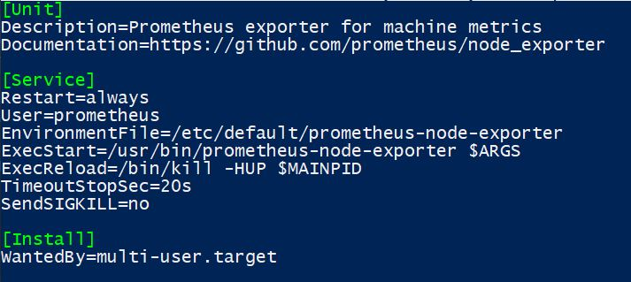
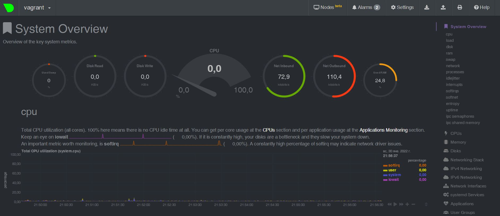

# Домашнее задание к занятию "3.4. Операционные системы, лекция 2"

1. На лекции мы познакомились с [node_exporter](https://github.com/prometheus/node_exporter/releases). В демонстрации его исполняемый файл запускался в background. Этого достаточно для демо, но не для настоящей production-системы, где процессы должны находиться под внешним управлением. Используя знания из лекции по systemd, создайте самостоятельно простой [unit-файл](https://www.freedesktop.org/software/systemd/man/systemd.service.html) для node_exporter:

    * поместите его в автозагрузку,
    * предусмотрите возможность добавления опций к запускаемому процессу через внешний файл (посмотрите, например, на `systemctl cat cron`),
    * удостоверьтесь, что с помощью systemctl процесс корректно стартует, завершается, а после перезагрузки автоматически поднимается.
   
___
   * node_exporter помещен в загрузку при старте системы при помощи `systemctl edit --full prometheus-node-exporter`:

   * агрумент `ARGS="--collector.logind"` добавленный через файл `/etc/defaults/prometheus-node-exporter` <br />
      можно наблюдать при выводе `ps aux`:<br />
```bash
root@vagrant:~# ps aux|grep node
prometh+     642  0.0  1.0 412320 10480 ?        Ssl  18:08   0:00 /usr/bin/prometheus-node-exporter --collector.logind
root        1351  0.0  0.0   6432   736 pts/0    R+   18:21   0:00 grep --color=auto node
root@vagrant:~#
```

2. Ознакомьтесь с опциями node_exporter и выводом `/metrics` по-умолчанию. Приведите несколько опций, которые вы бы выбрали для базового мониторинга хоста по CPU, памяти, диску и сети.
   * Для мониторинга можно использовать следующие опции: <br />
      * Для процессоров:
```bash
node_cpu_seconds_total{cpu="0",mode="idle"} 1442.84
node_cpu_seconds_total{cpu="0",mode="system"} 17.21
node_cpu_seconds_total{cpu="0",mode="user"} 9
node_cpu_seconds_total{cpu="1",mode="idle"} 1434.84
node_cpu_seconds_total{cpu="1",mode="system"} 18.99
node_cpu_seconds_total{cpu="1",mode="user"} 3.08
```
- Для памяти:
```bash
node_memory_MemAvailable_bytes
node_memory_MemFree_bytes
node_memory_Buffers_bytes

```
- Для сети:
```bash
node_network_transmit_bytes_total{device="eth0"} 
node_network_transmit_errs_total{device="eth0"}
node_network_receive_bytes_total{device="eth0"}
node_network_receive_errs_total{device="eth0"}
node_network_speed_bytes{device="eth0"}
```
- Для дисков:
```bash
node_disk_io_now{device="sda"}
node_disk_read_bytes_total{device="sda"}
node_disk_written_bytes_total{device="sda"}
 
```
3. Установите в свою виртуальную машину [Netdata](https://github.com/netdata/netdata). Воспользуйтесь [готовыми пакетами](https://packagecloud.io/netdata/netdata/install) для установки (`sudo apt install -y netdata`). После успешной установки:
    * в конфигурационном файле `/etc/netdata/netdata.conf` в секции [web] замените значение с localhost на `bind to = 0.0.0.0`,
    * добавьте в Vagrantfile проброс порта Netdata на свой локальный компьютер и сделайте `vagrant reload`:

    ```bash
    config.vm.network "forwarded_port", guest: 19999, host: 19999
    ```

    После успешной перезагрузки в браузере *на своем ПК* (не в виртуальной машине) вы должны суметь зайти на `localhost:19999`. Ознакомьтесь с метриками, которые по умолчанию собираются Netdata и с комментариями, которые даны к этим метрикам.
***
* После установки `netdata` и добавление в конфигурационный файл Vagrantfile строки `config.vm.network "forwarded_port", guest: 19999, host: 19999` подключение браузером с машины хоста на адрес `localhost:19999`стала доступена статистика `netdata`: <br />

4. Можно ли по выводу `dmesg` понять, осознает ли ОС, что загружена не на настоящем оборудовании, а на системе виртуализации?
* В выводе `dmesg` можно увидеть следующие данные: <br />
```bash
root@vagrant:~# dmesg |grep virt
[    0.005258] CPU MTRRs all blank - virtualized system.
[    0.045079] Booting paravirtualized kernel on KVM
[   12.315269] systemd[1]: Detected virtualization oracle.
root@vagrant:~#
```
5. Как настроен sysctl `fs.nr_open` на системе по-умолчанию? Узнайте, что означает этот параметр. Какой другой существующий лимит не позволит достичь такого числа (`ulimit --help`)?
   * Настройку `fs.nr_open` можно узнать следующим образом: <br />
```bash
root@vagrant:~# sysctl  fs.nr_open
fs.nr_open = 1048576
root@vagrant:~#
```
Другими "мягким" и "жестким" лимитами являются ограничение количества файловых дискриптеров на пользователя: <br />
```bash
root@vagrant:~# ulimit -n
1024
root@vagrant:~# ulimit -Hn
1048576
root@vagrant:~#
```
6. Запустите любой долгоживущий процесс (не `ls`, который отработает мгновенно, а, например, `sleep 1h`) в отдельном неймспейсе процессов; покажите, что ваш процесс работает под PID 1 через `nsenter`. Для простоты работайте в данном задании под root (`sudo -i`). Под обычным пользователем требуются дополнительные опции (`--map-root-user`) и т.д.
```bash
root@vagrant:~# unshare -f --pid --mount-proc /usr/bin/sleep 1h &
[2] 3355
root@vagrant:~# nsenter --target 3331 --pid --mount
root@vagrant:/# ps axu
USER         PID %CPU %MEM    VSZ   RSS TTY      STAT START   TIME COMMAND
root           1  0.0  0.0   5476   580 pts/0    S    19:53   0:00 /usr/bin/sleep 1h
root          15  0.0  0.4   7236  4108 pts/0    S    19:55   0:00 -bash
root          26  0.0  0.3   8892  3368 pts/0    R+   19:55   0:00 ps axu
root@vagrant:/#
```
7. Найдите информацию о том, что такое `:(){ :|:& };:`. Запустите эту команду в своей виртуальной машине Vagrant с Ubuntu 20.04 (**это важно, поведение в других ОС не проверялось**). Некоторое время все будет "плохо", после чего (минуты) – ОС должна стабилизироваться. Вызов `dmesg` расскажет, какой механизм помог автоматической стабилизации. Как настроен этот механизм по-умолчанию, и как изменить число процессов, которое можно создать в сессии?
   * Из поиска по интернету выяснилось, что это "форк-бомба". <br />
   Цитата:<br />
> Это называется вилочной бомбой . <br />
>:() означает, что вы определяете функцию под названием : <br />
>{:|:&} означает запустить функцию :<br />
>и : снова отправит ее вывод в функцию и запустить ее в фоновом режиме. <br />
>; разделитель команд. <br />
>: запускает функцию в первый раз. <br />
>По сути, вы создаете функцию, которая вызывает себя дважды при каждом вызове и не имеет возможности завершить себя. Он будет удваиваться, пока у вас не закончатся системные ресурсы.
* По умолчанию система настроена следующим образом: <br />
```bash
root@Father:~# ulimit -u
7823
root@Father:~#
```
* При помощи `dmesg` можно получить следующую информацию: <br />
```bash
* 
```
   
