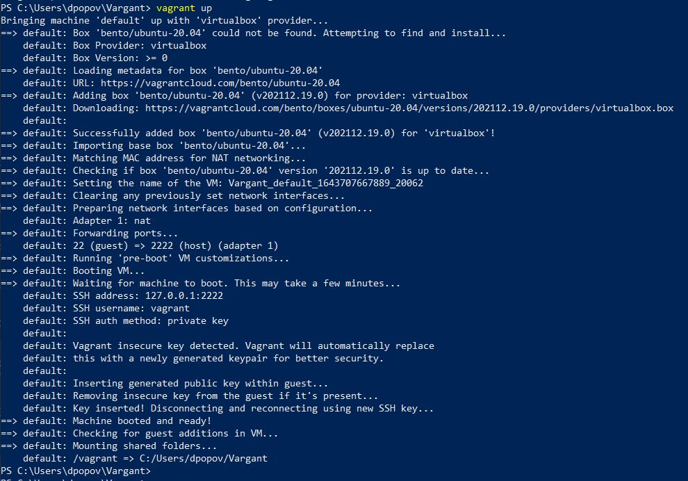
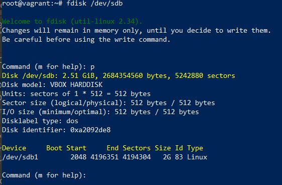
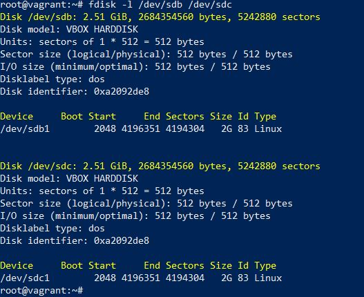
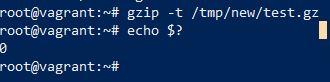
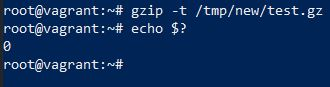

# Домашнее задание к занятию "3.5. Файловые системы"

1. Узнайте о [sparse](https://ru.wikipedia.org/wiki/%D0%A0%D0%B0%D0%B7%D1%80%D0%B5%D0%B6%D1%91%D0%BD%D0%BD%D1%8B%D0%B9_%D1%84%D0%B0%D0%B9%D0%BB) (разряженных) файлах.

* Разряженные файлы позволяют экономить место на диске и быстрее прочитывать файл
* Файловая система должна поддерживать запись метаданных для таких файлов
   
2. Могут ли файлы, являющиеся жесткой ссылкой на один объект, иметь разные права доступа и владельца? Почему?
   
* Хардлинки на один и тот же объект не могут иметь разные права доступа поскольку права доступа к файлу записываются непосредственно в inode файла, к которой эти жесткие ссылки и относятся.

3. Сделайте `vagrant destroy` на имеющийся инстанс Ubuntu. Замените содержимое Vagrantfile следующим:

    ```bash
    Vagrant.configure("2") do |config|
      config.vm.box = "bento/ubuntu-20.04"
      config.vm.provider :virtualbox do |vb|
        lvm_experiments_disk0_path = "/tmp/lvm_experiments_disk0.vmdk"
        lvm_experiments_disk1_path = "/tmp/lvm_experiments_disk1.vmdk"
        vb.customize ['createmedium', '--filename', lvm_experiments_disk0_path, '--size', 2560]
        vb.customize ['createmedium', '--filename', lvm_experiments_disk1_path, '--size', 2560]
        vb.customize ['storageattach', :id, '--storagectl', 'SATA Controller', '--port', 1, '--device', 0, '--type', 'hdd', '--medium', lvm_experiments_disk0_path]
        vb.customize ['storageattach', :id, '--storagectl', 'SATA Controller', '--port', 2, '--device', 0, '--type', 'hdd', '--medium', lvm_experiments_disk1_path]
      end
    end
    ```

    Данная конфигурация создаст новую виртуальную машину с двумя дополнительными неразмеченными дисками по 2.5 Гб.
   * 
4. Используя `fdisk`, разбейте первый диск на 2 раздела: 2 Гб, оставшееся пространство.
   *  
5. Используя `sfdisk`, перенесите данную таблицу разделов на второй диск.
   * 

6. Соберите `mdadm` RAID1 на паре разделов 2 Гб.
* Создаем RAID 1 и файловую систему:
```bash
root@vagrant:# sfdisk -d /dev/sdb > p_table
root@vagrant:# sfdisk /dev/sdc < p_table
root@vagrant:# mdadm --create --verbose /dev/md0 -l 1 -n 2 /dev/sdb1 /dev/sdc1
```

7. Соберите `mdadm` RAID0 на второй паре маленьких разделов.

```bash 
root@vagrant:# root@vagrant:# fdisk /dev/sdb
root@vagrant:# root@vagrant:# fdisk /dev/sdc
root@vagrant:# root@vagrant:# mdadm --create --verbose /dev/md1 -l 1 -n 2 /dev/sdb2 /dev/sdc2
```

* Добавляем запись о наших дисках в /etc/mdadm/mdadm.conf:

```bash
root@vagrant:# mdadm --detail --scan --verbose | awk '/ARRAY/ {print}' >> /etc/mdadm/mdadm.conf
```
  
8. Создайте 2 независимых PV на получившихся md-устройствах.
```bash
root@vagrant:# pvcreate /dev/md127
  Physical volume "/dev/md127" successfully created.
root@vagrant:# pvcreate /dev/md126
  Physical volume "/dev/md126" successfully created.
```

9. Создайте общую volume-group на этих двух PV.
```bash
root@vagrant:~# vgcreate vgroup01 /dev/md126 /dev/md127
  Volume group "vgroup01" successfully created 
```
10. Создайте LV размером 100 Мб, указав его расположение на PV с RAID0.

```bash
root@vagrant:~# lvcreate -L100 vgroup01 /dev/md126
  Logical volume "lvol0" created.
root@vagrant:~# lvdisplay
  --- Logical volume ---
  LV Path                /dev/vgroup01/lvol0
  LV Name                lvol0
  VG Name                vgroup01
  LV UUID                Xa2gUu-r4Xw-qSjn-i6H9-fpHa-kPUQ-557X3V
  LV Write Access        read/write
  LV Creation host, time vagrant, 2022-02-01 16:27:49 +0000
  LV Status              available
  # open                 0
  LV Size                100.00 MiB
  Current LE             25
  Segments               1
  Allocation             inherit
  Read ahead sectors     auto
  - currently set to     4096
  Block device           253:1
```

11. Создайте `mkfs.ext4` ФС на получившемся LV.
```bash
root@vagrant:~# mkfs.ext4 /dev/vgroup01/lvol0
mke2fs 1.45.5 (07-Jan-2020)
Creating filesystem with 25600 4k blocks and 25600 inodes

Allocating group tables: done
Writing inode tables: done
Creating journal (1024 blocks): done
Writing superblocks and filesystem accounting information: done

root@vagrant:~#
```

12. Смонтируйте этот раздел в любую директорию, например, `/tmp/new`.

```bash
root@vagrant:~# mkdir /tmp/new
root@vagrant:~# mount /dev/vgroup01/lvol0 /tmp/new/
root@vagrant:~# 
```

13. Поместите туда тестовый файл, например `wget https://mirror.yandex.ru/ubuntu/ls-lR.gz -O /tmp/new/test.gz`.
```bash
root@vagrant:~# wget https://mirror.yandex.ru/ubuntu/ls-lR.gz -O /tmp/new/test.gz
--2022-02-01 16:33:36--  https://mirror.yandex.ru/ubuntu/ls-lR.gz
Resolving mirror.yandex.ru (mirror.yandex.ru)... 213.180.204.183, 2a02:6b8::183
Connecting to mirror.yandex.ru (mirror.yandex.ru)|213.180.204.183|:443... connected.
HTTP request sent, awaiting response... 200 OK
Length: 22079405 (21M) [application/octet-stream]
Saving to: ‘/tmp/new/test.gz’

/tmp/new/test.gz                              100%[==============================================================================================>]  21.06M  19.6MB/s    in 1.1s

2022-02-01 16:33:37 (19.6 MB/s) - ‘/tmp/new/test.gz’ saved [22079405/22079405]

root@vagrant:~# 
```
14. Прикрепите вывод `lsblk`.
```bash
root@vagrant:~# lsblk
NAME                      MAJ:MIN RM  SIZE RO TYPE  MOUNTPOINT
loop0                       7:0    0 55.4M  1 loop  /snap/core18/2128
loop1                       7:1    0 61.9M  1 loop  /snap/core20/1328
loop2                       7:2    0 55.5M  1 loop  /snap/core18/2284
loop3                       7:3    0 70.3M  1 loop  /snap/lxd/21029
loop4                       7:4    0 67.2M  1 loop  /snap/lxd/21835
loop5                       7:5    0 43.4M  1 loop  /snap/snapd/14549
loop6                       7:6    0 32.3M  1 loop  /snap/snapd/12704
sda                         8:0    0   64G  0 disk
├─sda1                      8:1    0    1M  0 part
├─sda2                      8:2    0    1G  0 part  /boot
└─sda3                      8:3    0   63G  0 part
  └─ubuntu--vg-ubuntu--lv 253:0    0 31.5G  0 lvm   /
sdb                         8:16   0  2.5G  0 disk
├─sdb1                      8:17   0    2G  0 part
│ └─md127                   9:127  0    2G  0 raid1
└─sdb2                      8:18   0  511M  0 part
  └─md126                   9:126  0 1018M  0 raid0
    └─vgroup01-lvol0      253:1    0  100M  0 lvm   /tmp/new
sdc                         8:32   0  2.5G  0 disk
├─sdc1                      8:33   0    2G  0 part
│ └─md127                   9:127  0    2G  0 raid1
└─sdc2                      8:34   0  511M  0 part
  └─md126                   9:126  0 1018M  0 raid0
    └─vgroup01-lvol0      253:1    0  100M  0 lvm   /tmp/new 

```

15. Протестируйте целостность файла:

     ```bash
     root@vagrant:~# gzip -t /tmp/new/test.gz
     root@vagrant:~# echo $?
     0
     ```
* 

16. Используя pvmove, переместите содержимое PV с RAID0 на RAID1.
```bash
root@vagrant:~# pvmove /dev/md126 /dev/md127
  /dev/md126: Moved: 20.00%
  /dev/md126: Moved: 100.00%
root@vagrant:~#
```

17. Сделайте `--fail` на устройство в вашем RAID1 md.
```bash
root@vagrant:~# root@vagrant:~# mdadm /dev/md127 --fail /dev/sdb1
mdadm: set /dev/sdb1 faulty in /dev/md127
root@vagrant:~#
```


18. Подтвердите выводом `dmesg`, что RAID1 работает в деградированном состоянии.
```bash
root@vagrant:~# dmesg |tail -n2
[ 5246.784405] md/raid1:md127: Disk failure on sdb1, disabling device.
               md/raid1:md127: Operation continuing on 1 devices.
root@vagrant:~# 
```
19. Протестируйте целостность файла, несмотря на "сбойный" диск он должен продолжать быть доступен:

     ```bash
     root@vagrant:~# gzip -t /tmp/new/test.gz
     root@vagrant:~# echo $?
     0
     ```


20. Погасите тестовый хост, `vagrant destroy`.

