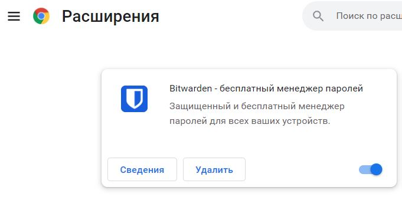
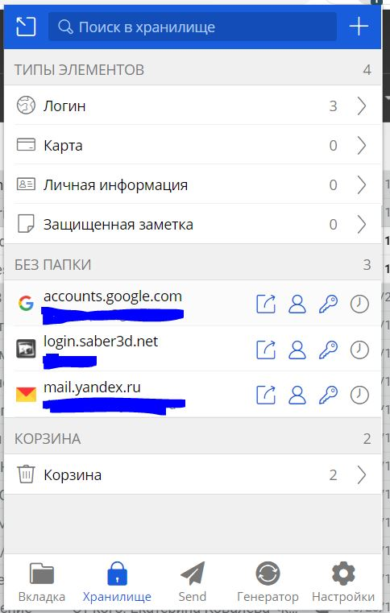
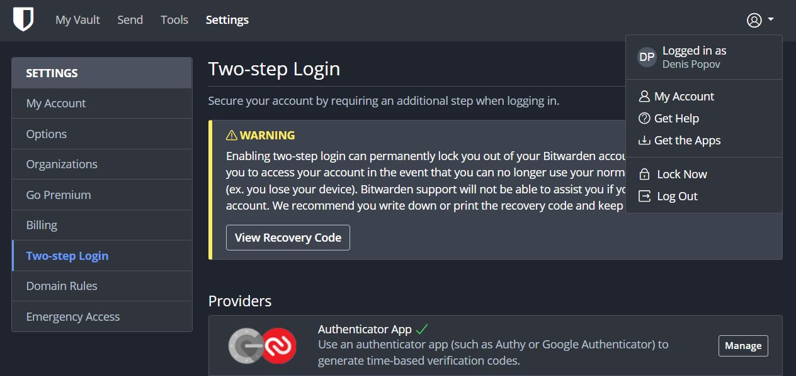
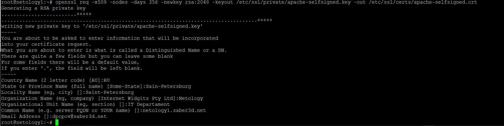
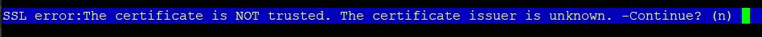
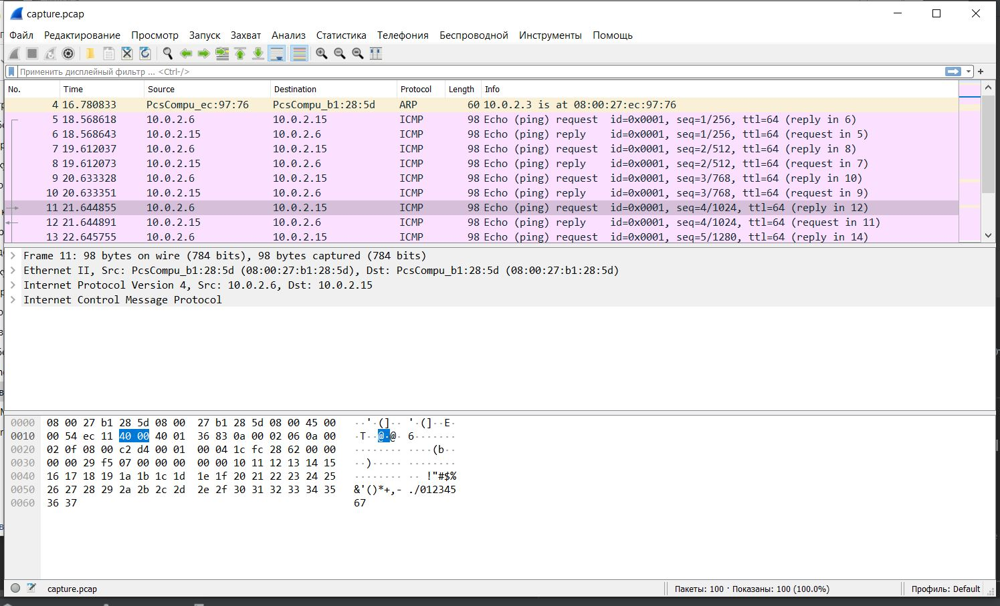

# Домашнее задание к занятию "3.9. Элементы безопасности информационных систем"

1. Установите Bitwarden плагин для браузера. Зарегестрируйтесь и сохраните несколько паролей.
* Установлен плагин для браузера </br>

* Сохранены несколько паролей </br>


2. Установите Google authenticator на мобильный телефон. Настройте вход в Bitwarden акаунт через Google authenticator OTP.
* Установлен и настроен Google authenticator для входа в аккаунт Bitwarden </br>


3. Установите apache2, сгенерируйте самоподписанный сертификат, настройте тестовый сайт для работы по HTTPS.
* Сначала подключим ssl модуль для apache2
```commandline
root@netology1:~# a2enmod ssl
Considering dependency setenvif for ssl:
Module setenvif already enabled
Considering dependency mime for ssl:
Module mime already enabled
Considering dependency socache_shmcb for ssl:
Enabling module socache_shmcb.
Enabling module ssl.
See /usr/share/doc/apache2/README.Debian.gz on how to configure SSL and create self-signed certificates.
To activate the new configuration, you need to run:
  systemctl restart apache2
root@netology1:~#
```
* Перезапустим apache2 чтоб изменения вступили в силу и убедимся, что заработал 443 порт (ssl)
```
root@netology1:~#systemctl restart apache2
root@netology1:~# ss -tnpl
State      Recv-Q     Send-Q         Local Address:Port         Peer Address:Port     Process
LISTEN     0          4096           127.0.0.53%lo:53                0.0.0.0:*         users:(("systemd-resolve",pid=638,fd=13))
LISTEN     0          128                  0.0.0.0:22                0.0.0.0:*         users:(("sshd",pid=745,fd=3))
LISTEN     0          511                        *:80                      *:*         users:(("apache2",pid=3343,fd=4),("apache2",pid=3342,fd=4),("apache2",pid=3341,fd=4))
LISTEN     0          128                     [::]:22                   [::]:*         users:(("sshd",pid=745,fd=4))
LISTEN     0          511                        *:443                     *:*         users:(("apache2",pid=3343,fd=6),("apache2",pid=3342,fd=6),("apache2",pid=3341,fd=6))
root@netology1:~#
```
* Создаем самоподписанный сертификат

* Добавляем SSL в конфигурацию 
```commandline
root@netology1:~# nano /etc/apache2/sites-available/your_domain_or_ip.conf
<VirtualHost *:443>
   ServerName netology1
   DocumentRoot /var/www/html

   SSLEngine on
   SSLCertificateFile /etc/ssl/certs/apache-selfsigned.crt
   SSLCertificateKeyFile /etc/ssl/private/apache-selfsigned.key
</VirtualHost>
```
* Перезапускаем apache2
```commandline
root@netology1:~#systemctl restart apache2
```
* Подключаемся к серверу по SSL
```commandline
root@netology1:~# lynx https://localhost
```
* Подтверждаем, что согласны на самоподписанный сертификат

* Просматриваем тестовую страницу </br>

4. Проверьте на TLS уязвимости произвольный сайт в интернете (кроме сайтов МВД, ФСБ, МинОбр, НацБанк, РосКосмос, РосАтом, РосНАНО и любых госкомпаний, объектов КИИ, ВПК ... и тому подобное).
* Запускаем проверку svalko.org
```commandline
root@netology1:~/DevOps-15/testssl.sh# ./testssl.sh -U --sneaky  https://svalko.org

###########################################################
    testssl.sh       3.1dev from https://testssl.sh/dev/
    (b3e4ac8 2022-03-09 11:17:45 -- )

      This program is free software. Distribution and
             modification under GPLv2 permitted.
      USAGE w/o ANY WARRANTY. USE IT AT YOUR OWN RISK!

       Please file bugs @ https://testssl.sh/bugs/

###########################################################

 Using "OpenSSL 1.0.2-chacha (1.0.2k-dev)" [~183 ciphers]
 on netology1:./bin/openssl.Linux.x86_64
 (built: "Jan 18 17:12:17 2019", platform: "linux-x86_64")


 Start 2022-03-09 17:01:28        -->> 188.120.235.72:443 (svalko.org) <<--

 rDNS (188.120.235.72):  svalko.org.
 Service detected:       HTTP


 Testing vulnerabilities

 Heartbleed (CVE-2014-0160)                not vulnerable (OK), timed out
 CCS (CVE-2014-0224)                       not vulnerable (OK)
 Ticketbleed (CVE-2016-9244), experiment.  not vulnerable (OK), no session ticket extension
 ROBOT                                     Server does not support any cipher suites that use RSA key transport
 Secure Renegotiation (RFC 5746)           supported (OK)
 Secure Client-Initiated Renegotiation     not vulnerable (OK)
 CRIME, TLS (CVE-2012-4929)                not vulnerable (OK)
 BREACH (CVE-2013-3587)                    potentially NOT ok, "gzip" HTTP compression detected. - only supplied "/" tested
                                           Can be ignored for static pages or if no secrets in the page
 POODLE, SSL (CVE-2014-3566)               not vulnerable (OK)
 TLS_FALLBACK_SCSV (RFC 7507)              No fallback possible (OK), no protocol below TLS 1.2 offered
 SWEET32 (CVE-2016-2183, CVE-2016-6329)    not vulnerable (OK)
 FREAK (CVE-2015-0204)                     not vulnerable (OK)
 DROWN (CVE-2016-0800, CVE-2016-0703)      not vulnerable on this host and port (OK)
                                           make sure you don't use this certificate elsewhere with SSLv2 enabled services
                                           https://censys.io/ipv4?q=CA55443B4576C00DA5C5E029EA153506782E4ADB21D99DD89973C90422955FD3 could help you to find out
 LOGJAM (CVE-2015-4000), experimental      not vulnerable (OK): no DH EXPORT ciphers, no DH key detected with <= TLS 1.2
 BEAST (CVE-2011-3389)                     not vulnerable (OK), no SSL3 or TLS1
 LUCKY13 (CVE-2013-0169), experimental     potentially VULNERABLE, uses cipher block chaining (CBC) ciphers with TLS. Check patches
 Winshock (CVE-2014-6321), experimental    not vulnerable (OK) - CAMELLIA or ECDHE_RSA GCM ciphers found
 RC4 (CVE-2013-2566, CVE-2015-2808)        no RC4 ciphers detected (OK)


 Done 2022-03-09 17:01:58 [  33s] -->> 188.120.235.72:443 (svalko.org) <<--


root@netology1:~/DevOps-15/testssl.sh#

```

5. Установите на Ubuntu ssh сервер, сгенерируйте новый приватный ключ. Скопируйте свой публичный ключ на другой сервер. Подключитесь к серверу по SSH-ключу.
* Генерируем ssh ключ
```commandline
root@netology1:~/DevOps-15/testssl.sh# cd
root@netology1:~# ssh-key
ssh-keygen   ssh-keyscan
root@netology1:~# ssh-key
ssh-keygen   ssh-keyscan
root@netology1:~# ssh-keygen -t rsa
Generating public/private rsa key pair.
Enter file in which to save the key (/root/.ssh/id_rsa):
Enter passphrase (empty for no passphrase):
Enter same passphrase again:
Your identification has been saved in /root/.ssh/id_rsa
Your public key has been saved in /root/.ssh/id_rsa.pub
The key fingerprint is:
SHA256:rmoboG6z+Lglb6wlzb2C+c2H8jBRBU8b90qm3XECFTI root@netology1
The key's randomart image is:
+---[RSA 3072]----+
|    ..+ E.o.     |
|     + + =       |
|    . o o + .    |
|   .   = o +     |
|  o   . S .      |
| + +   .         |
|++B o.  .        |
|=X==oo..         |
|*O*=B+.          |
+----[SHA256]-----+
root@netology1:~#

```
* Запускаем ssh-агента, добавляем в него ключ и проверям загруженный в агента ключ
```commandline
root@netology1:~# eval `ssh-agent`
Agent pid 30062
root@netology1:~# ssh-add
Identity added: /root/.ssh/id_rsa (root@netology1)
root@netology1:~# ssh-add -l
3072 SHA256:rmoboG6z+Lglb6wlzb2C+c2H8jBRBU8b90qm3XECFTI root@netology1 (RSA)
root@netology1:~#
```
* Скопируем ключ на удаленный сервер
```commandline
root@netology1:~# ssh-copy-id vagrant@10.0.2.9
/usr/bin/ssh-copy-id: INFO: Source of key(s) to be installed: "/root/.ssh/id_rsa.pub"
The authenticity of host '10.0.2.9 (10.0.2.9)' can't be established.
ECDSA key fingerprint is SHA256:RztZ38lZsUpiN3mQrXHa6qtsUgsttBXWJibL2nAiwdQ.
Are you sure you want to continue connecting (yes/no/[fingerprint])? yes
/usr/bin/ssh-copy-id: INFO: attempting to log in with the new key(s), to filter out any that are already installed
/usr/bin/ssh-copy-id: INFO: 1 key(s) remain to be installed -- if you are prompted now it is to install the new keys
vagrant@10.0.2.9's password:

Number of key(s) added: 1

Now try logging into the machine, with:   "ssh 'vagrant@10.0.2.9'"
and check to make sure that only the key(s) you wanted were added.

root@netology1:~#
```
* Пробуем подключиться к удаленному хосту при помощи ключа
```commandline
root@netology1:~# ssh vagrant@10.0.2.9
Welcome to Ubuntu 20.04.3 LTS (GNU/Linux 5.4.0-91-generic x86_64)

 * Documentation:  https://help.ubuntu.com
 * Management:     https://landscape.canonical.com
 * Support:        https://ubuntu.com/advantage

  System information as of Wed 09 Mar 2022 06:11:01 PM UTC

  System load:  0.0                Processes:             123
  Usage of /:   11.9% of 30.88GB   Users logged in:       1
  Memory usage: 20%                IPv4 address for eth0: 10.0.2.6
  Swap usage:   0%                 IPv4 address for eth1: 10.0.2.9


This system is built by the Bento project by Chef Software
More information can be found at https://github.com/chef/bento
Last login: Wed Mar  9 18:04:36 2022 from 10.0.2.2
vagrant@netology2:~$
```
* Успешно! </br>

6. Переименуйте файлы ключей из задания 5. Настройте файл конфигурации SSH клиента, так чтобы вход на удаленный сервер осуществлялся по имени сервера.
* Переименовываем файлы ключей
```commandline
vagrant@netology1:~$ mv .ssh/id_rsa .ssh/my_id_rsa
vagrant@netology1:~$ mv .ssh/id_rsa.pub .ssh/my_id_rsa.pub
```
* добавляем переименованный ключ ssh агенту
```commandline
vagrant@netology1:~$ ssh-add .ssh/my_id_rsa
Identity added: .ssh/my_id_rsa (vagrant@netology1)
vagrant@netology1:~$
```
* настраиваем файл конфигурации клиента
```commandline
vagrant@netology1:~$ touch .ssh/config && chmod 600 .ssh/config
vagrant@netology1:~$ nano .ssh/config
vagrant@netology1:~$ cat .ssh/config
Host netology2
 HostName 10.0.2.9
 IdentityFile ~/.ssh/my_rsa_key
 User vagrant
vagrant@netology1:~$
```
* Пробуем подключиться по имени сервера
```commandline
vagrant@netology1:~$ ssh netology2
Welcome to Ubuntu 20.04.3 LTS (GNU/Linux 5.4.0-91-generic x86_64)

 * Documentation:  https://help.ubuntu.com
 * Management:     https://landscape.canonical.com
 * Support:        https://ubuntu.com/advantage

  System information as of Wed 09 Mar 2022 06:27:34 PM UTC

  System load:  0.0                Processes:             123
  Usage of /:   11.9% of 30.88GB   Users logged in:       1
  Memory usage: 20%                IPv4 address for eth0: 10.0.2.6
  Swap usage:   0%                 IPv4 address for eth1: 10.0.2.9


This system is built by the Bento project by Chef Software
More information can be found at https://github.com/chef/bento
Last login: Wed Mar  9 18:24:00 2022 from 10.0.2.15
vagrant@netology2:~$
```
* Успех!

7. Соберите дамп трафика утилитой tcpdump в формате pcap, 100 пакетов. Откройте файл pcap в Wireshark.
* Запускаем отлов 100 пакетов
```commandline
root@netology1:~# tcpdump -i eth0 -c100 -w capture.pcap
tcpdump: listening on eth0, link-type EN10MB (Ethernet), capture size 262144 bytes
100 packets captured
100 packets received by filter
0 packets dropped by kernel
root@netology1:~# 
```
* Открываем в WinShark


---
## Задание для самостоятельной отработки (необязательно к выполнению)

8*. Просканируйте хост scanme.nmap.org. Какие сервисы запущены?

9*. Установите и настройте фаервол ufw на web-сервер из задания 3. Откройте доступ снаружи только к портам 22,80,443


 ---