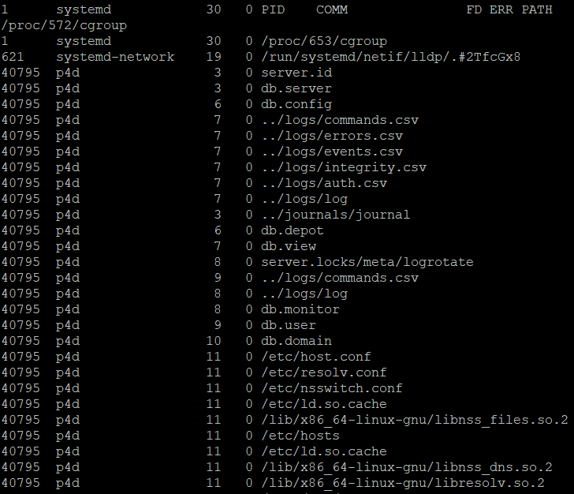

# Домашнее задание к занятию "3.3. Операционные системы, лекция 1"

1. Какой системный вызов делает команда `cd`? В прошлом ДЗ мы выяснили, что `cd` не является самостоятельной  программой, это `shell builtin`, поэтому запустить `strace` непосредственно на `cd` не получится. Тем не менее, вы можете запустить `strace` на `/bin/bash -c 'cd /tmp'`. В этом случае вы увидите полный список системных вызовов, которые делает сам `bash` при старте. Вам нужно найти тот единственный, который относится именно к `cd`. Обратите внимание, что `strace` выдаёт результат своей работы в поток stderr, а не в stdout.
   * В выводе `strace` можно увидеть вызов который делает `bash` по команде `/bin/bash -c 'cd /tmp'`
    ```bash
    chdir("/tmp") 
    ```
2. Попробуйте использовать команду `file` на объекты разных типов на файловой системе. Например:
      ```bash
      vagrant@netology1:~$ file /dev/tty
      /dev/tty: character special (5/0)
      vagrant@netology1:~$ file /dev/sda
      /dev/sda: block special (8/0)
      vagrant@netology1:~$ file /bin/bash
      /bin/bash: ELF 64-bit LSB shared object, x86-64
      ```
      Используя `strace` выясните, где находится база данных `file` на основании которой она делает свои догадки.
   * Вывод `strace file /dev/tty` покажет, что база данных типов файлов может находиться в файле `/usr/share/misc/magic.mgc`
3. Предположим, приложение пишет лог в текстовый файл. Этот файл оказался удален (deleted в lsof), однако возможности сигналом сказать приложению переоткрыть файлы или просто перезапустить приложение – нет. Так как приложение продолжает писать в удаленный файл, место на диске постепенно заканчивается. Основываясь на знаниях о перенаправлении потоков предложите способ обнуления открытого удаленного файла (чтобы освободить место на файловой системе).
   * Вот несколько вариантов обнуления файлового дескриптора для удаленного файла:
   ```bash
   $cat /dev/null > /proc/<PID>/fd/1
   ```
   ```bash
   $echo "" > /proc/<PID>/fd/1
   ```
   ```bash
   $:> /proc/<PID>/fd/1
   ```
      
4. Занимают ли зомби-процессы какие-то ресурсы в ОС (CPU, RAM, IO)?
   * Зомби-процессы не занимают CPU, RAM, IO.
5. В iovisor BCC есть утилита `opensnoop`:
    ```bash
    root@vagrant:~# dpkg -L bpfcc-tools | grep sbin/opensnoop
    /usr/sbin/opensnoop-bpfcc
    ```
    На какие файлы вы увидели вызовы группы `open` за первую секунду работы утилиты? Воспользуйтесь пакетом `bpfcc-tools` для Ubuntu 20.04. Дополнительные [сведения по установке](https://github.com/iovisor/bcc/blob/master/INSTALL.md).
   * В первые секунды после запуска `opensnoop-pbfcc` вывел следующие вызовы:
     ```bash
     root@ubu2:~/testing# opensnoop-bpfcc |tee file
     ```
     
6. Какой системный вызов использует `uname -a`? Приведите цитату из man по этому системному вызову, где описывается альтернативное местоположение в `/proc`, где можно узнать версию ядра и релиз ОС.
   * Команда `uname -a` использует системный вызов `uname()`. Цитата из `man 2 uname` : `Part of the utsname information is also accessible via /proc/sys/kernel/{ostype, hostname, osrelease, version, domainname}`
 
7. Чем отличается последовательность команд через `;` и через `&&` в bash? Например:
    ```bash
    root@netology1:~# test -d /tmp/some_dir; echo Hi
    Hi
    root@netology1:~# test -d /tmp/some_dir && echo Hi
    root@netology1:~#
    ```
    Есть ли смысл использовать в bash `&&`, если применить `set -e`?
   * В случае специального символа `;` команды выполняются последовательно вне зависимости от кода завершения. В случае `&&` каждая следующая команда выполняется только в случае успешного завершения `exit 0` предыдущей команды. В случае же использования параметра `set -e` не имеет смысла использовать служебный символ `&&` поскольку `set -e` проверяет существование указанного файла или директории.
8. Из каких опций состоит режим bash `set -euxo pipefail` и почему его хорошо было бы использовать в сценариях?
   * `set -euxo pipefail` состоит из следующих опций:
     - `-e` выход с не-нулевым статусом при первой же ошибке. 
     - `-u` проверяет назначение всех используемых переменных
     - `-x` показывает аргументы выполняемых простых команд (for,case,select)
     - `-o pipefail` опции позволяют убедиться, что все команды в конвеере выполнены успешно со статусом `exit 0` или c последним не-нулевым статусом выполнение сценария на месте, где произошла ошибка. 
9. Используя `-o stat` для `ps`, определите, какой наиболее часто встречающийся статус у процессов в системе. В `man ps` ознакомьтесь (`/PROCESS STATE CODES`) что значат дополнительные к основной заглавной буквы статуса процессов. Его можно не учитывать при расчете (считать S, Ss или Ssl равнозначными).
   * Самым частым статусом процесса в системе является S (interruptable sleep) и I (idle kernel thread).
