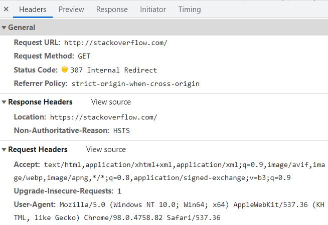
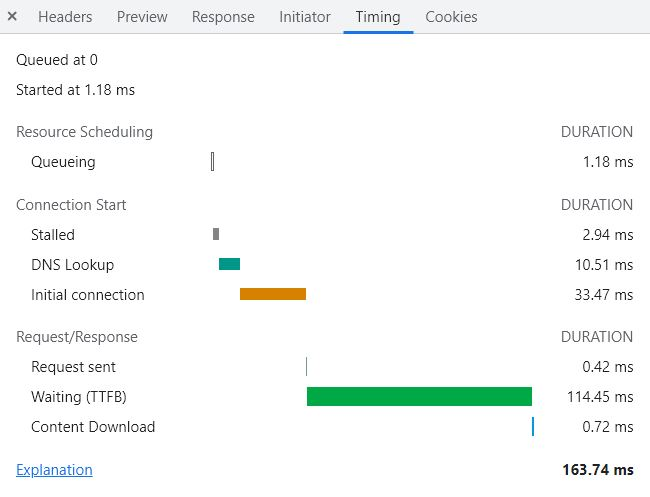
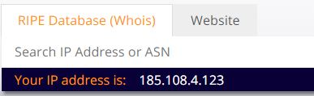

# Домашнее задание к занятию "3.6. Компьютерные сети, лекция 1"

1. Работа c HTTP через телнет.
- Подключитесь утилитой телнет к сайту stackoverflow.com
`telnet stackoverflow.com 80`
- отправьте HTTP запрос
```bash
GET /questions HTTP/1.0
HOST: stackoverflow.com
[press enter]
[press enter]
```
- В ответе укажите полученный HTTP код, что он означает?
* Ответ на запрос выглядит следующим образом:
```
root@p4-doi:~# telnet stackoverflow.com 80
Trying 151.101.1.69...
Connected to stackoverflow.com.
Escape character is '^]'.
GET /questions HTTP/1.0
HOST: stackoverflow.com

HTTP/1.1 301 Moved Permanently
cache-control: no-cache, no-store, must-revalidate
location: https://stackoverflow.com/questions
x-request-guid: a7a85cf0-3553-478d-8012-7be78ea8a358
feature-policy: microphone 'none'; speaker 'none'
content-security-policy: upgrade-insecure-requests; frame-ancestors 'self' https://stackexchange.com
Accept-Ranges: bytes
Date: Wed, 16 Feb 2022 09:43:46 GMT
Via: 1.1 varnish
Connection: close
X-Served-By: cache-hhn4050-HHN
X-Cache: MISS
X-Cache-Hits: 0
X-Timer: S1645004626.397276,VS0,VE156
Vary: Fastly-SSL
X-DNS-Prefetch-Control: off
Set-Cookie: prov=f837b6a0-037d-f8a7-b534-7829e01df4e2; domain=.stackoverflow.com; expires=Fri, 01-Jan-2055 00:00:00 GMT; path=/; HttpOnly

Connection closed by foreign host.
root@p4-doi:~#
```
* Ответ `HTTP/1.1 301 Moved Permanently` означает, что страница перемещена. </br>
Также в ответе сервер указывает, где находится перемещенная страница `location: https://stackoverflow.com/questions`
2. Повторите задание 1 в браузере, используя консоль разработчика F12.
- откройте вкладку `Network`
- отправьте запрос http://stackoverflow.com
- найдите первый ответ HTTP сервера, откройте вкладку `Headers`
- укажите в ответе полученный HTTP код.
    * Как можно увидеть в ответе сервера, мы видим код статуса 307 и внутренне перенаправление.

- проверьте время загрузки страницы, какой запрос обрабатывался дольше всего?
- приложите скриншот консоли браузера в ответ.
    * График показывает, что больше всего времени ушло на подготовку сервером данных запрошенной страницы для отправки клиенту `(TTFB = 114,45 ms)`.

3. Какой IP адрес у вас в интернете?</br>

4. Какому провайдеру принадлежит ваш IP адрес? Какой автономной системе AS? Воспользуйтесь утилитой `whois`
* Утилита `whois` выдает следующую информацию, автономная система AS56534, провайдер ООО "Комфортел":</br>
```
root@p4-doi:~# whois 185.108.4.123
...
role:           Comfortel Ltd Contacts Data
address:        Oktyabrskaya 10-1
address:        193091 St.Petersburg Russia
phone:          +7 812 670 00 00
fax-no:         +7 812 670 00 00 ext. 4
abuse-mailbox:  abuse@comfortel.pro
admin-c:        ME3174-RIPE
tech-c:         POOF-RIPE
...
origin:         AS56534
...
```
5. Через какие сети проходит пакет, отправленный с вашего компьютера на адрес 8.8.8.8? Через какие AS? Воспользуйтесь утилитой `traceroute`
* Команда `traceroute -An` покажет нам через какипе AS проходит пакет до адреса 8.8.8.8:
```
root@p4-doi:~# traceroute -An 8.8.8.8
traceroute to 8.8.8.8 (8.8.8.8), 30 hops max, 60 byte packets
 1  10.93.48.1 [*]  0.187 ms  0.163 ms  0.155 ms
 2  192.168.3.58 [*]  3.391 ms  3.900 ms  3.306 ms
 3  92.255.103.225 [AS56534]  0.922 ms  5.326 ms  1.060 ms
 4  10.200.1.10 [*]  6.439 ms  6.460 ms  3.854 ms
 5  193.28.6.50 [AS48625]  2.716 ms  1.682 ms  1.806 ms
 6  74.125.244.132 [AS15169]  1.864 ms  1.136 ms  2.826 ms
 7  142.251.61.219 [AS15169]  5.038 ms  7.163 ms 72.14.232.85 [AS15169]  2.665 ms
 8  142.251.61.221 [AS15169]  6.829 ms 142.250.210.47 [AS15169]  8.496 ms 142.251.61.221 [AS15169]  6.758 ms
 9  216.239.63.65 [AS15169]  6.655 ms * 172.253.70.51 [AS15169]  9.426 ms
10  * * *
11  * * *
12  * * *
13  * * *
14  * * *
15  * * *
16  * * *
17  * * *
18  8.8.8.8 [AS15169]  5.919 ms  5.927 ms  7.331 ms
root@p4-doi:~#
```
6. Повторите задание 5 в утилите `mtr`. На каком участке наибольшая задержка - delay?
* Наибольшая *средняя* задержка образуется на 9 хопе, там *средняя* задержка составляет 8.4 миллисекунды.</br>
```
root@p4-doi:~# mtr -nz 8.8.8.8

p4-doi (10.93.48.5)                                                  2022-02-16T13:30:03+0300
Keys:  Help   Display mode   Restart statistics   Order of fields   quit
                                                     Packets               Pings
 Host                                              Loss%   Snt   Last   Avg  Best  Wrst StDev
 1. AS???    10.93.48.1                             0.0%    56    0.2   1.0   0.2   6.6   1.5
 2. AS???    192.168.3.58                           0.0%    56    2.3   2.0   0.3  15.9   2.8
 3. AS56534  92.255.103.225                         0.0%    56    8.1   2.9   0.6  12.6   2.7
 4. AS???    10.200.1.10                            0.0%    55    1.8   3.8   0.7  26.4   4.1
 5. AS???    193.28.6.50                            0.0%    55    3.6   4.4   0.9  70.6   9.4
 6. AS15169  74.125.244.132                         0.0%    55   11.2   3.6   1.0  22.5   3.5
 7. AS15169  72.14.232.85                           0.0%    55    5.7   5.2   1.3  89.6  11.8
 8. AS15169  142.251.61.221                         0.0%    55    8.8   7.4   5.2  13.0   1.8
 9. AS15169  142.250.57.7                           0.0%    55    7.6   8.4   5.2  76.1   9.5
10. ???
11. ???
12. ???
13. ???
14. ???
15. ???
16. ???
17. ???
18. ???
19. AS15169  8.8.8.8                               12.7%    55    7.5   6.8   4.4  14.0   2.2
```
7. Какие DNS сервера отвечают за доменное имя dns.google? Какие A записи? воспользуйтесь утилитой `dig`
* Команда `dig +trace dns.google @8.8.8.8` позволяет нам увидеть какие сервера отвечают за зону `google` и адреса хоста `dns.google`:<br>
```
google.                 172800  IN      NS      ns-tld1.charlestonroadregistry.com.
google.                 172800  IN      NS      ns-tld2.charlestonroadregistry.com.
google.                 172800  IN      NS      ns-tld3.charlestonroadregistry.com.
google.                 172800  IN      NS      ns-tld4.charlestonroadregistry.com.
google.                 172800  IN      NS      ns-tld5.charlestonroadregistry.com.
google.                 86400   IN      DS      6125 8 2 80F8B78D23107153578BAD3800E9543500474E5C30C29698B40A3DB2 3ED9DA9F
google.                 86400   IN      RRSIG   DS 8 1 86400 20220301050000 20220216040000 9799 . E9gHwYV752o64KXiDc82YAfI80IRkVPNDWU3OgQp9g2YR3yIUbFTA1wu LBPqxPr0Aolfg1oW368Hcy1dhUj3rSVaCspDoRAg7RsuVIXs4uI7AQZF q2brVVEx3Jep9oclUeel/TpRTtI27JHBJd9ysFVJrapgOkwfGTxcg6L7 MVpkYC1FbzYFW2MmuNwrhLLsdzBctIswJDMzFmbgv2o0b6BFqEPK/TEA QG9NUdu0WbNBF0AhmT7AZM/GZfhCWgOPcH1/zJA92dB2SV5s6l4snh63 WB5EC6R6hX0Itbwjw0POptTRk6UNnhwP8y/NqNQGVtALSoqXrJ7y/Vhf k41BzQ==
;; Received 730 bytes from 192.203.230.10#53(e.root-servers.net) in 15 ms

dns.google.             10800   IN      NS      ns2.zdns.google.
dns.google.             10800   IN      NS      ns4.zdns.google.
dns.google.             10800   IN      NS      ns1.zdns.google.
dns.google.             10800   IN      NS      ns3.zdns.google.
dns.google.             3600    IN      DS      56044 8 2 1B0A7E90AA6B1AC65AA5B573EFC44ABF6CB2559444251B997103D2E4 0C351B08
dns.google.             3600    IN      RRSIG   DS 8 2 3600 20220308222204 20220214222204 39106 google. Y79smjY3xfYT0iYCfKg4xFKVa79mUuY2zx701xBxjFNO3gdInGeHkanu eR+wuiEn3vM5V69COYoLgSgk4K38oy0Rd4fhuu4j7hFype+XKGO8dhVZ atJXwKrL6k3hQYCZYvX1ksP2FgYEY90mQx7xsH4TupplNPoX1fs3ZXnT QeU=
;; Received 506 bytes from 216.239.60.105#53(ns-tld5.charlestonroadregistry.com) in 134 ms

dns.google.             900     IN      A       8.8.4.4
dns.google.             900     IN      A       8.8.8.8
dns.google.             900     IN      RRSIG   A 8 2 900 20220307120732 20220213120732 25800 dns.google. Kap8xUB2kuHwdtW+zn+rUsoEVQgtUhFV8D9ora+4xHxhmehohTvJ1ES9 cs1oq7igHDlfRTkw9F6LIhPoNXtGrPM8EANzL2MJ6DAZOTOuqsgHYiJ1 b6whTQUAuEUB6VxQ25ESSAg51RTvxfI+52P5ufb7Z9N0FzEk0z87viUv ovQ=
;; Received 241 bytes from 216.239.34.114#53(ns2.zdns.google) in 39 ms
```
8. Проверьте PTR записи для IP адресов из задания 7. Какое доменное имя привязано к IP? воспользуйтесь утилитой `dig`
* При помощи команды `dig -x 8.8.8.8` мы сможем увидеть PTR запись адреса `8.8.8.8`
```commandline
root@p4-doi:~# dig -x 8.8.8.8

; <<>> DiG 9.11.5-P4-5.1+deb10u6-Debian <<>> -x 8.8.8.8
;; global options: +cmd
;; Got answer:
;; ->>HEADER<<- opcode: QUERY, status: NOERROR, id: 64588
;; flags: qr rd ra; QUERY: 1, ANSWER: 1, AUTHORITY: 0, ADDITIONAL: 1

;; OPT PSEUDOSECTION:
; EDNS: version: 0, flags:; udp: 4000
;; QUESTION SECTION:
;8.8.8.8.in-addr.arpa.          IN      PTR

;; ANSWER SECTION:
8.8.8.8.in-addr.arpa.   4027    IN      PTR     dns.google.

;; Query time: 2 msec
;; SERVER: 10.93.20.2#53(10.93.20.2)
;; WHEN: Wed Feb 16 14:04:29 MSK 2022
;; MSG SIZE  rcvd: 73

root@p4-doi:~#
```
